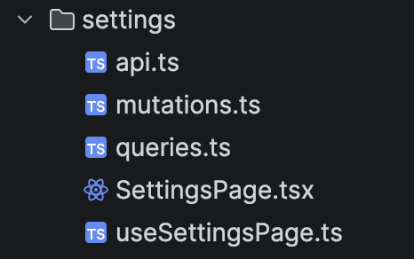
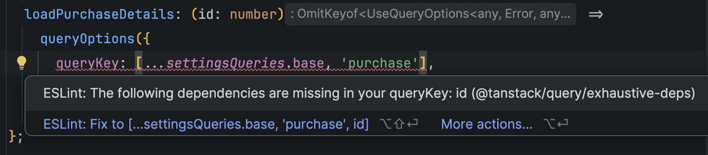

While ago, working on the frontend codebase of one of my projects, I saw something that was bothering me.
As the app is using TanStack Query, we had queries and query keys scattered all over the place. Sometime afterwards I was reading [TkDodo's blog](https://tkdodo.eu/blog) and ran into so called query factories, where all query keys are grouped in one place and reused.

I'm sharing with you the setup I created in the codebase of the project with the reference to TkDodo's

# Codebase

Not so important, but for easier following, this project has feature based organization of files, something similar to this:



Let's assume we have some kind of a `SettingsPage`, which is a presentation component and in it `useSettingsPage` hook which is the brain of the component.

```tsx
export const SettingsPage = () => {
  const { data } = useSettingsPage();

  return (
    <>
      <h1>Settings Page</h1>
      {JSON.stringify(data)}
    </>
  );
};
```

Inside `useSettingsPage` hook you would probaly have some kind of data fetching and parsing going on.
With query factories, you would create one reusable object with query options and you would use it in any place or any case you needed to.

```tsx
export const useSettingsPage = () => {
  // different use cases of the same query options
  const { data, isPending, error } = useQuery(settingsQueries.loadSettings());
  usePrefetchQuery(settingsQueries.loadSettings());
  useSuspenseQuery(settingsQueries.loadSettings());

  // use case with arguments
  const {
    data: purchaseDetails,
    isPending: isPurchaseDetailsPending,
    error: purchaseDetailsError,
  } = useQuery(settingsQueries.loadPurchaseDetails(123456789));

  // ...additional business logic...

  return {
    data,
    isPending,
    error,
    purchaseDetails,
    isPurchaseDetailsPending,
    purchaseDetailsError,
  };
};
```

One of the best ways to share `queryKey` and `queryFn` between multiple places, yet keep them co-located to one another, is to use the `queryOptions` helper. Introduced in [v5 version](https://tanstack.com/query/latest/docs/framework/react/guides/query-options).

```tsx
export const settingsQueries = {
  base: ["settings"] as const,
  loadSettings: () =>
    queryOptions({
      queryKey: [...settingsQueries.base, "details"],
      queryFn: getSettings,
    }),
  loadPurchaseDetails: (id: number) =>
    queryOptions({
      queryKey: [...settingsQueries.base, "purchase", id],
      queryFn: () => getPurchaseDetails(id),
    }),
};
```

One of the selling points of this pattern, that I encountered, is when invalidating queries inside mutations, one would have to re-type the `queryKey` of the query one wanted to invalidate...often leading to spelling mistakes or simply specifying wrong query keys. In this case this is mitigated.

```tsx
export const useSettingsUpdateMutation = (onSettled: VoidFunction) => {
  const queryClient = useQueryClient();

  return useMutation({
    mutationFn: updateSettings,
    onSuccess: () => {
      // invalidate all settings queries
      void queryClient.invalidateQueries({ queryKey: settingsQueries.base });

      // or just invalidate settings details query
      void queryClient.invalidateQueries(settingsQueries.loadSettings());
    },
    onError: () => {
      // handle error
    },
    onSettled: onSettled,
  });
};
```

# Bonus: Linting

What I also use with this setup is <em>@tanstack/eslint-plugin-query</em>. Which gives safety margins in case you forget to specify correct key. Like so:


