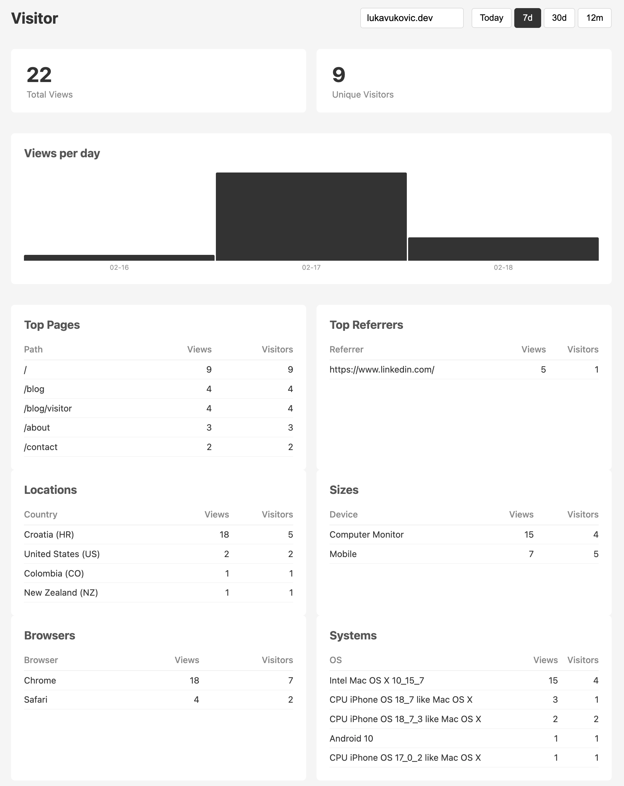

After I published my <em>Blogfolio</em> (Blog + Portfolio) couple of weeks ago, I started enriching it with some writings of my own.
I want to make content of my blog valuable, as I see and read so many blogs from IT gurus around the world.

The first thing I'm interested in is whether anyone reads my blog, or visits my website, at all. To do that, one would need some kind of analytics tool embedded into their website.
Some of the popular ones like Google analytics, Goatcounter, Matomo, Plausible etc. were the option.

I wanted to have something open-source, that I don't have to pay :), and something dead simple with some basic analytics data.

So I decided to build my own analytics tool. Afterwards named - <em>Visitor</em>.

# Stack

The analytics tool consists of four parts:

1. <b>Go server</b> - holds all the business logic
2. <b>PostgreSQL database</b> - for storing visitor events
3. <b>tracker script</b> written in JavaScript - for sending visitor events to the server
4. <b>Dashboard</b> HTML page - for overview of analytics data

# Usage

I'm using Visitor on this very website you're reading the blog from.

It is embedded inside website's `<head>` element.

```js
<script defer src="https://visitor.lukavukovic.dev/tracker.js"></script>
<script is:inline>
  document.addEventListener("astro:page-load", () => {
    if (window.trackVisit) window.trackVisit();
  });
</script>
```

Since I'm using Astro's `ClientRouter` for view transitions, the app is actually SPA (Single Page Application) so it's not reloaded when user navigates from one page to another, hence I added event listener that triggers on `astro:page-load` event and executes the tracker script.

# Hosting

I'm using [Oracle Cloud](https://www.oracle.com/cloud/) to host the golang server along with the tracker script and the dashboard, as they have a generous free tier options.

For database, I'm using [Supabase](https://supabase.com/) for PostgreSQL database as they also have free tier which is enough storage room for the purpose of concise analytics data.

<b>Total cost: 0 €</b>

# Data

The data I'm collecting is minimal but important to me as I can reflect very well on it.

The most important data for me is which pages or blogs are most visited.

On the image below you can see how the dashboard view looks like with small amount of aggregated data.



# GDPR

Why no cookies or consent are needed? :)

1. No personal data ever stored — the raw IP and user agent are used only as hash inputs, then discarded. The database only stores the hash, never the IP.

2. No persistent client-side identifiers — tracker.js sets zero cookies, uses no local storage, and does no fingerprinting. Each page view is fully independent.

3. No re-identification possible — once the daily salt is deleted, even I cannot reverse the hashes to identify a visitor. This satisfies GDPR's pseudonymization requirements.

4. Minimal data collection — only path, referrer, screen size, country code, browser, and operating system are stored. All aggregate, none personal.

5. No cross-day profiling — daily salt rotation makes it technically impossible to build long-term visitor profiles.
